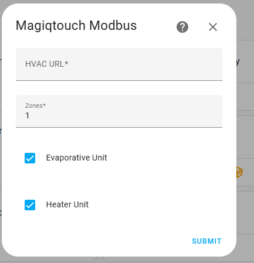
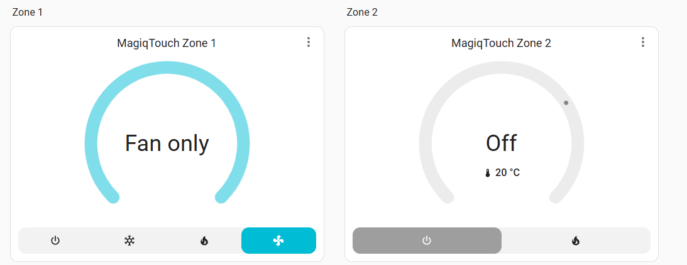
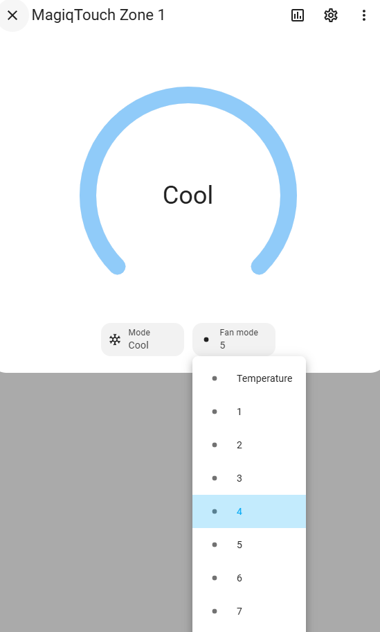

# Home Assistant Integration for the MagiqTouch Modbus ESP32 Interface

ESP Project: https://github.com/mrhteriyaki/magiqtouch-modbus-esp32

Add this repo to HACS: https://github.com/mrhteriyaki/magiqtouch-modbus-esp32-ha
Or manual install by copying custom_components folder.

## Configuration:

1. Set the URL of the HVAC ESP32 Module eg: http://192.168.20.112
2. Set your zone count.
3. Tick Evap / Heater modules for your supported setup.

Dashboard display:

Details showing fan speed selection and option to use temperature mode:

